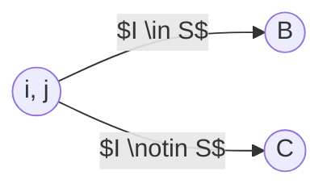
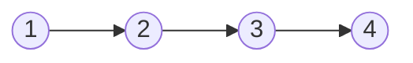
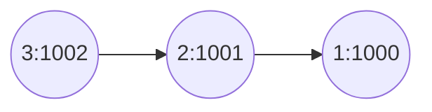
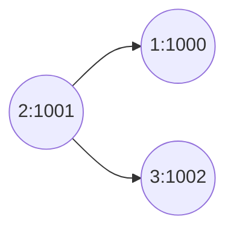
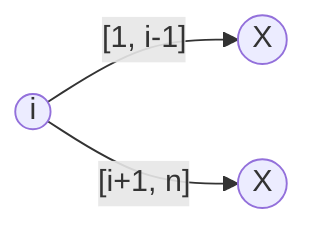
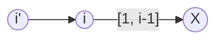

# Programação Competitiva - Professor: Vinícius Santos

## 10/03/2025 - Aula 01

Principal objetivo é implementar.

Estudar algoritmos e estruturas de dados que sejam úteis para competições de programação.

- Avaliação da disciplina:
  - Problemas: implementar. Se passar, ganha o ponto. Se não passar, não ganha o ponto.
  - Em torno de 5 listas valendo 20 pontos cada.
  - Ele tá considerando colocar alguns pontos para participação em sala.
  - Cogita também fazer uma prova no final.
  - Pelo menos 90% serão pontos de lista.
- Não há uma bibliografia da disciplina
  - Ele tem um conjunto de coisas que pode-se seguir, mas é só de referência
- Sites interessantes
  - codeforces.com
  - cp-algorithms.com
- Linguagem: tudo em C/C++ "C+" (C com algumas coisinhas de C++, como STL)
- > Uma coisa interessante da programação competitiva é que algumas vezes você passa muito mais tempo pensando do que Codando.
- NÃO DEIXAR PRA ÚLTIMA HORA
- Primeira lista: aproximadamente 25 problemas
  - Ele vai tentar enviar antes da quarta (ele viajará)
- Outras: de 10 a 15 problemas
- Ele gosta de pegar o problema e ir batendo cabeça junto. Começando pelas soluções ingênuas até chegar nas mais eficientes.
- Em Maio ele deve viajar por duas semanas. Talvez alguém dê aula pra gente nesse período.
- O simulado é para simular um campeonato de programação. O resultado do simulado é ponto extra.
- Devemos fazer de 1 a 3 simulados.

### Dijkstra

- Conceito:
  - pode ser em direcionado ou não direcionado e não pode ter peso negativo.
  - Depois do primeiro (source), adicionamos os vértices para os quais ele foi, comeando pelo menor.
  - O menor então atualiza as novas menores distâncias atingíveis.
- Pseudocódigo:
  - Inicialização
  - repita n -1 vezes
    - seja v o vértice desmarcado com o mentor dist[v]
    - marque v
    - para cada vizinho w de v
      - se dist[w] > dist[v] + peso(v, w)
        - dist[w] = dist[v] + peso(v, w)

- Como melhorar?
  - Usar lista de adjacência ao invés de matriz de adjacência.
    - O Loop de verificação de vizinhos é o somatórios dos vizinhos que é igual a 2|E(G)|.
  - Pode-se melhorar a verificação de qual é o vértice com menor distância.
  - Dá pra usar um heap que tenha um índice dizendo onde que tá cada nó, e sempre que atualizar a distância, atualiza também a lista de índices.
  - Complexidade: $O((m+n) \log n)$
  - [JV: Não entendi direito porque o máximo de vértices de uma heap caso adicionasse todos os vizinhos atualizados deve ser 2m e não nm]
  - $m \leq \binom{n}{2} < n^2$

#### Implementação

```c
#include <bits/stdc++.h>

#include <iostream>
#include <string>
#include <vector>
#include <E MAIS UM MONTE DE COISA>

#define _ ios_base::sync_with_stdio(0); cin.tie(0); //primeiro ele tá desligando a sincronização para tornar mais rápido; cin geralmente é mais lento. O cin.tie desliga algum algum tipo de buffer.

#define endl '\n' // o std::endl é mais lento que o '\n' porque o std::endl faz um flush no buffer.

// Lembrar ele de falar sobre o INF e LINF
#define ??? 0x3f3f3f3f // 1061109567
#define ??? 0x3f3f3f3fll // ???

vector <int> dist, marca; // distância e marcação
int n;

vector <vector <int> > adj; // lista de adjacência
vector <vector <int> > peso; // lista de adjacência

// OU

vector<vector<pair<int, int>>> adj; // lista de adjacência

// vecotr<vector<pair<int, int>>> adj; // lista de adjacência

void dijkstra(int s){
  dist.resize(n);
  marca.resize(n);
  for (int i = 0; i < n; i++){
    dist[i] = INF;
    marca[i] = 0;
  }

  priority_queue<pair<int, int>> fila; // heap

  dist[s] = 0;
  fila.push(make_pair(0, s));

  for (int i = 0; i < n; i++){
    int v;
    do{
      v = (fila.top()).second;
      fila.pop();
    } while (marca[v]);

    marca[v] = 1;

    for (int j = 0; j < adj[v].size(); j++){
      int w = adj[v][j].second;
      int c = adj[v][j].first;

      if (dist[w] > dist[v] + c){
        dist[w] = dist[v] + c;
        fila.push(make_pair(-dist[w], w));  
      }
    }
  }
}

int main (){ _
  int m;
  cin >> n >> m;

  adj.resize(n);
  for (int i = 0; i < m; i++){
    int a, b, c;
    cin >> a >> b >> c;
    a--; b--;

    adj[a].push_back(make_pair(c, b));
    adj[b].push_back(make_pair(c, a));
  }

  dijkstra(5-1);

  for (int i = 0; i < n; i++){
    ...
  }

}

```

```txt
entrada do grafo

5 7
5 1 4
5 2 9
5 4 5
1 2 3
2 3 2
3 4 1
2 4 10
```

- O que é um pair?
  - É uma struct com dois valores em que o primeiro valor tá armazenado na chave first e o segundo na chave second

## 12/03/2025 - Aula XX - Sem Aula

## 17/03/2025 - Aula 02

- Submissão das 5 listas no Beecrowd
- A primeira é até dia 9 de abril às 23h59

---

Template do Moodle:

```c
#include <bits/stdc++.h> // Tende a incluir tudo que seria necessário
```

---

- Casos de teste que não informam como acabam:
  - Pode-se analisar o valor de entrada do cin, e/ou verificar o EOF (End Of File)

```cpp
while(cin >> n){ // Roda enquanto não for EOF
  ...
};
```

Comando para rodar enviando um arquivo como entrada:
  
```bash
./a.out < input.txt
```

Não precisa armazenar todas as saídas para imprimir no final.

Aluno: "O que é o cin? Ele tem uma notação esquisita"
Professor: "Isso eu vou deixar você pesquisar no Google."

---

### Bitmask

Se temos uma lista de elementos, podemos representar um subconjunto deles com um número binário.

|||||7, 6, 5, 4, 3, 2, 1, 0|
X = [1, 0, 1, 1, 0, 0, 1, 0]
Y = [1, 1, 1, 0, 1, 0, 1, 1]

Checar interseção: & bitwise
União: ou bitwise

adição de um elemento: [1 na posição, 0 no resto, e faz um OU]
Remover um elemento: [0 na posição, 1 no resto, e faz um AND]

```cpp
int liga(int i) {
  return 1 << i; // liga o iésimo valor do byte
}

int checaLigado(int X, int i) { // Checa se o iésimo valor está ligado
  return X & liga(i);
}

int main(){
  int n = 10;
  int X = 0;
  for (int i = 0; i < n; i++)
    X |= liga(i); // X = X|liga(i);
  
  // Outra alternativa seria usar o
  X = (1 << (n+1)) - 1;
  // Dessa forma, teríamos 10000000000, reduzido 1: 1111111111

  X = X | Y; // União
  X = X & Y; // Interseção
  // X = X ^ Y; // Diferença simétrica "Quem tá em um mas não tá no outro" || É o Ou Exclusivo
  X = X & ~liga(3); // Remover; O ~ nega bit a bit.

  // popcount: Contar quantos bits estão ligados
  int conta = 0;
  for (int i = 0; i < n; i++){
    if (ligado(i))
      conta ++;
  }
  cout << conta << endl;
}
```

Dá pra usar longlongint para conjuntos de 64 elementos "E não há nenhum conjunto com mais do que 64 elementos 😜".

Estudar sobre STL.

### Outras coisas

```cpp

#define endl '\n'

void main(){
  pair <int, char> p;
  // ou:
  p = make_pair(19, 'j');
  // ou: p = {19, 'j'};
  q = p;
  if (p==q) cout << "Igual" << endl;
  
  q.second = 'z';
  if (p<q) cout << "Menor" << endl;
  
}
```

### String

```cpp
#define endl '\n'
void main(){
  string s, s2;
  // é diferente de char s[100];
  s += "X";
  // s = "X" + s; // Ineficiente
  s2 = s; // Fez uma cópia (custo linear)
  s2[1] = 'l';
  cout << s2 <<endl;

  s = "paralelepipedo";
  s.erase(s.size()-1);
  count << s << endl;
  // O Exit sai do programa; tende a sair mais rápido;
  // O return 0 chama os destrutores (?)
  //tende a ser uma boa prática usar o return 0 ou exit(0) no final do programa
}
```

### Vector

```cpp
#define endl '\n'

int main(){
  vector <int> v;

  v.resize(10);
  v[5] = 0;
  v.size();

  return 0;
}
```

### Set

Conjunto de elemntos

unordered_set tende a ser mais rápido

```cpp
#define endl '\n'

int main(){
  set <int> s;
  s.insert(10);
  s.insert(20);
  s.insert(10);
  if (s.find(4) == conj.end())
    cout << "Não achou" << endl;
  s.size();
  s.erase(10);
  s.size();
  s.clear();
  s.size();
  return 0;
}
```

### Map

Conjunto de não elementos.

Existe também o unordered_map que é mais rápido.

```cpp
#define endl '\n'

int main(){
  map <string, int> m;
  m["um"] = 1;
  m["dois"] = 2;
  m["um"] = 3;
  m.size();
  m.erase("um");
  m.size();
  m.clear();
  m.size();

  for (int i = 0; i < 3; i++){
    cin >> nome >> idade;
    mapa[nome] = idade;
  }

  if (mapa["vinicius"] <30) { // Não fazer isso; Se não achar, ele cria um novo elemento
    // E mesmo não existindo isso daqui consideraria como verdadeiro.
  }

  // Ao invés disso, faça:
  if (mapa.find("João") != mapa.end() && mapa["João"] < 30)
    cout << "João já estava no mapa e tinha idade menor que 30" << endl;

  cout << "conteudo do map" << endl;
  for (auto it = mapa.begin(); it != mapa.end(); ++it){ // é tipo o for item in list
    cout << it->first << " " << it->second << endl;
    cout << (*it).first << " " << (*it).second << endl;
  }

  return 0;
}
```

## 19/03/2025 - Aula 03 - Chamada no início da aula

- Tradeoffs:
  - O mais eficiente e complicado ou o mais simples mas com pior complexidade?
  - No geral, ter o menor esforço: menor tempo gasto para programar em um que passe. Preferencialmente que entregue mais rápido ao invés de ser mais eficiente, desde que passe.

"Tudo o que o problema te prometer, não precisa conferir".

Evitar alocação dinâmica. Fácil demais de se embananar no processo.

"Faça de um jeito menos elegante mas que seja mais difícil de você errar"

### Complexidades comuns em desafios

- $n$
- $n \log n$
- $n^2$
- $n^2 \log n$
- $n^3$
- $n^4$
- $2^n$
- $n!$
- $n^n$

"Quantas operações consigo fazer em um segundo?" "Tipicament em torno de $10^8 \leq$ operações por segundo $< 10^9$"

| Complexidades | $10^8 \leq$ | valor de $n$ | $< 10^9$ |
| ------------- | ----------- | :----------: | -------- |
| $n$           |             | $10^6~10^8$  |          |
| $n \log n$    |             | $10^5~10^6$  |          |
| $n \sqrt{n}$  |             |   $~10^5$    |          |
| $n^2$         |             | $\leq 10^4$  |          |
| $n^2 \log n$  |             |   $< 10^4$   |          |
| $n^3$         |             |   $< 10^3$   |          |
| $n^4$         |             |    $10^2$    |          |
| $2^n$         |             |    $~ 26$    |          |
| $n^2 2^n$     |             |    $< 20$    |          |
| $n!$          |             |     $12$     |          |
| $n^n$         |             |    $< 9$     |          |

Geralmente se passa em $n$, também passa em $n \log n$

### Ponto Flutuante

- Evite Ponto Flutuante. Use ao máximo o inteiro.
  - Ponto flutuante tem erro de precisão
    - Sinal | Mantissa | Expoente
    - $A*2^B$
    - $0,5 = 1*2^{-1} = 2*2^{-2} = \dots$
    - $0,2 = 0,125 + 0,0625 + \dots$
  - Float - 4 bytes: 24 bits de mantissa
  - Double - 8 bytes: 53 bits de mantissa
  - Long double - Mais precisão mas mais lento
  - Geralmente o problema define a quantidade de dígitos de precisão

Não compare a variável de double com uma outra, ou com 0. Talvez tenha algum lixo no cálculo.

Ao invés disso, melhor checar se $|x-y| \leq \epsilon$ onde o $\epsilon geralmente tá entre $10^{-6}$ e $10^{-9}$

Ao invés de usar ponto flutuante, pode-se usar racionais, ou seja, algum struct com numerador e denominador, e implementa também as operações entre frações. Porém, as contas podem acabar estourando o int, talvez tendo que encontrar o MDC para reduzir a fração.

> Não usar POW, porque POW é double

Ao invés de verificar $x \leq y$, ao invés disso poderíamos verificar se ($x < y || |x-y| \leq \epsilon \equiv x \leq y + \epsilon$)

### "Coisas simples que já sabemos mas não paramos pra pensar"

- limites
  - $n \leq 10^5$, $n$ é ímpar
  - $k \leq 10^9$
  - $1 \leq a_1, \dots, a_n \leq 10^8$
- Caso de teste
  - 5 10
  - 10 8 4 5 1
- Problema
  - Operação: escolher $a_i$ e incrementá-lo.
  - Posso fazer $k$ operações
  - Qual o maior valor possível para a mediana?
- Solução
  - É tipo encher de água um buraco de mineração:
    - Você começa da mediana | a parte onde o nível da água já começa é a mediana. Sempre que eu quiser aumentar a mediana preciso encher tudo simultaneamente;
    - O máximo que você puder encher todos os valores acima da mediana, você consegue encontrar a melhor mediana com esses $k$ incrementos
- Problema alternativo:
  - Dado uma outra entra $m$, é possível tornar a mediana $\geq m$?
- Solução do problema alternativo: partindo da mediana, soma as diferenças entre o $k$ e a mediana, até alcançar o objetivo ou estourar o limite.

Uma forma de melhor de $O(n)$ seria fazer um tipo de vetor acumulado.

- Então no caso:
  - -3, 1, 4, 5, 8, 10, 15
  - Teríamos o intervalo:
            - 5~8 = 3; 5 e 8~10=7; 5 e 8 e 10 ~ 15 = 22
            - Ou seja, de 5 a 8 aumenta 3; Para chegar a 10, precisa aumentar tanto o 5 quanto o 8 para 10 em 2 unidades. E depois, tanto o 5, quanto o 8, quanto o 10 em 5 unidades até o 15.

---

Um outro problema seria: Até determinado ponto a resposta é sim, a partir de um threshold, a resposta é não. Como encontrar o maior valor desse threshold?

Faz-se uma busca binária onde todo "não" seria um intervalo aberto e todo "sim" seria fechado, sempre indo pra metade.

Um outro jeito é ir avançando $2^i$, $2^{i+1}$, até encontrar o ponto que a resposta é não na posição $2^l$, e então sabemos que os bounds são $2^{l-1}$ e $2^l$. Essa ideia aí é a busca binária ilimitada.

---

## 24/03/2025 - Aula 04

- Aula passada:
  - $f(k)$:
    - $k \leq K_{\max} \to$ possível
    - $k > K_{\max} \to$ impossível
  - Ao invés de $O(n \log n)$, deveria ser $O(n \log k)$
  - Mais precisamente: $O(n (\log k + \log n))$

---

### Problema 1: Distribuição de torres de sinal de internet

- Descrição
  - Estão distribuídas em (x, y)
  - Como encontrar o menor raio de comunicação?
    - "Menor raio que todas as torres precisam ter para que todas as torres se comuniquem?"
  - Resposta com float
- **Resolução 1:** MSP
  - Primeiro faz o grafo completo
  - Cada grafo tem como peso a distância entre eles
  - Devemos encontrar uma Árvore Geradora Mínima de tal modo que consigamos que a maior aresta seja a menor possível
    - [JV: eu tava considerando que não necessariamente essa seria a melhor solução, porém, pelo argumento da troca, se há outra aresta melhor, que a maior, então isso implicaria na existência de outro MSP (Minimum Spanning Tree) com essa aresta melhor que seria globalmente menor.]
  - Complexidade: $O(m \log n)$
    - $m \leq \binom{n}{2} < n^2$
    - Porém $m$ é quadrático porque no pior caso o grafo é completo
  - Obs.: Não precisa usar a raiz para calcular as distâncias. Só no final faria a raiz para ter as distâncias.
- **Resolução 2:** Busca Binária
  - Faz uma busca binária no raio
  - Define o problema como um problema de decisão: para um raio $r$ é possível gerar um grafo conexo?
  - $D = \max_{\forall i, j} dist (i, j)$
  - $d \in [0, D]$
  - Complexidade: $O(\log D)$ para encontrar o inteiro que queremos. Porém, a resposta tem uma precisão de $10^{-6}$, então precisamos testar mais $\log 10^6$ vezes para encontrar a precisão.
  - Podemos também ordenar todas as distâncias possíveis em um vetor, e então a complexidade será
    - $O(\log n^2) = O(\log n)$
  - Surgiu uma discussão de que há uma complexidade omissa nessa solução que seria o de ordenação do vetor de distâncias, o que certamente tornaria a **Resolução 1** mais eficiente.

### Problema 2: menor distância entre transeuntes

- Descrição
  - temos duas pessoas que começam em dois pontos diferentes para uma determinada direção com uma determinada velocidade.
  - Encontrar a menor distância entre elas.
- Construção
  - $P_1(t) = P_1(0) + t \cdot \overrightarrow{v_1}$
  - $\min_{\forall t \geq 0} |P_1(t) - P_2(t)|^2$
- **Solução 1**
  - Análise matemática analítica: considerando a situação inicial a gente consegue definir matematicamente uma solução física que encontra a menor distância.
- **Solução 2**
  - Busca Binária (BB) no tempo [0, T]
  - BB na distância [0, dist(P_1(0), P_2(0))]
  - Na real, busca ternária no gráfico
  - Não definimos onde ele está, mas sim, onde não está.
  - Na busca binária: $l, r$
    - $m = (l+r)/2$
  - Na busca ternária: $l, r$
    - $m_1 = l + (r-l)/3$
    - $m_2 = r - (r-l)/3$
    - Em casos de apenas inteiro, distâncias menores que 3 não gerariam alterações
  - Complexidade: $\log_{\frac{3}{2}} n$
- **Solução 3:**
  - Outra alternativa sera a busca binária ilimitada

### Problema 3: checar soma de dois elementos

- Descrição:
  - $S$ com $n$ inteiros, e um inteiro $x$
  - $\forall s \in S, s \leq 10^9$
  - $\exists a, b \in S, a \neq b$
  - $a + b = x$?
- **Solução 1**
  - Podemos definir os valores de $s$ em um número binário.
  - Ou então fazer um vetor contando a quantidade de vezes que cada número aparece.
  - Complexidade: $O(S_{max} + n)$
    - $n =$ leitura da entrada
    - $S_{max} =$ o tamanho do vetor e definir todos os valores como 0
  - Para isso adicionamos todos os valores de $s$ menores que $x$ no vetor, e depois verificamos um a um se o valor de $x-a$ também está presente.
- **Solução 2**
  - para cada número, verificar se $x-a$ também está presente em BB
  - Complexidade: $O(n \log n)$ (Ordenar + BB)
- **Solução 3:** Técnica dos dois ponteiros
  - partindo do vetorzão, ordenamos.
  - Começamos com os índices $l$ e $r$. Se a soma dos dois for maior que $x$, decrementamos o $r$, se for menor, incrementamos o $l$.

### Problema 4: ao invés de checar a soma, verificar se existe $a, b, x$

## 26/03/2025 - Aula 05

### Problema "Port Recovery"(?)

- Problema "Port Recovery"(?)
  - Ex:
    - 11112
    - 11112
    - 121224
    - ===
    - 1+11=12
    - 11+1=12
    - 12+12=24
    - ===
    - 11+1=12
    - 1+11=12
    - 12+12=24
  - O resultado geralmente é pela ordem lexicografica

### Retomando o problema (4) de ontem

- Solução 1:
  - Verificar se há um triplo $a, b, x$ tal que $a+b=x$
  - Então escolhe um x qualquer e então faz linearmente com aqueles dois índices.
  - Fazendo para todos os X teremos então a complexidade de $O(n^2)$
- Esse problema seria similar a $a+b+x=0$, que é basicamente a mesma coisa que o anterior, só que com x negativo.

### Problema 6.1

- Descrição
  - Subsetsum
  - dado um $v[], n, x, v[i] \geq 0, \forall i$
  - $\exists l, r | \sum_{i=l}^{k} v[i] = x?$
- **Solução 1:** Ingênuo, testa todos os casos
  - $O(n^3)$
- **Solução 2:** Somatório de acumulados
  - $\sum_{i=l}^{k} v[i] = \sum_{i=0}^{r} v[i] - \sum_{i=0}^{l-1} v[i]$
  - Faz-se um vetor de somas acumuladas, e então faz-se uma busca binária para encontrar o valor de $x$.
  - Complexidade: $O(n \log n)$
- **Solução 3:** Técnica dos dois ponteiros
  - $l, r$, ambos começando na esquerda
  - Se a soma for menor que $x$, incrementa o $r$, se for maior, incrementa o $l$.
  - Com isso, no somatório acumulado, sempre soma o valor de $v[r]$ e subtrai o valor de $v[l-1]$
  - Há alguma garantia de que não pulamos nenhuma solução viável?

### Formas de debugar

- 3 códigos
  - Gerador de casos de teste
  - Código de execução 1
  - Código de execução 2
  - Checa se os dois resultados são iguais

### Problema 6.2

- Descrição
  - Dados X, $y \exists S \subset X$ tal que $\sum_{s \in S} s = y$?
- **Solução**
  - Problema da mochila/Subsetsum
  - Se quero percorrer todas as possibilidades dos 11111, posso ir até o 100000, ou seja (1<<n)
  - código
    - $for (i=0; i < (1<<n); i++)$
      - $for (j=0; j < n; j++)$
        - $if (i & (1<<j))$
          - $soma += v[j]$
      - $if (soma == y)$
        - $return;$
  - Complexidade: $O(2^n \cdot n)$

### Problema 6.3

- Descrição
  - O mesmo que o anterior, porém queremos ter de 0 a 3 itens.
- **Solução 1**
  - Usar vetor de inteiros, subtrair os itens que adicionarmos no conjunto, e se não encontrarmos, fazemos o refresh do valor.
- **Solução 2**
  - Usamos a base 3

### Problema 6.4

- Descrição
  - Quero tentar todas as possíveis combinações de:
    - X[] = {1, 2, 3, 4, 5}
    - Q[] = {1, 3, 2,2}
  - Não entendi legal
- **Solução**
  - Código
    - $rec(int p)$
      - $if (p == n)$
        - $\dots$
        - $return;$
      - $if(rec(p+1))$
        - $for (i=1; i <= Q[p]; i++)$
          - $soma += X[p]$
          - $if(rec(p+1))$
        - $soma -= Q[p] \cdot X[p]$
      - $return false;$
  - Complexidade: $O(2^n)$?

### Problema 6.5

- Descrição
  - $\forall S \subset X, |S| = k$
  - Verificar se $P(S)=true$
- **Solução**
  - Código
    - $S[]$
    - $rec(int p, int q)$
      - $if (q == k)$
        - $return confere();$
      - $if (p == n)$
        - $return;$
      - $S[q] = p;$
      - $if (rec(p+1, q+1)) return true;$
      - $if (rec(p+1, q)) return true;$
      - $return false;$

## 31/03/2025 - Aula 06

### Tarefa que foi pra casa

- Todos os subconjuntos: $2^n$
- Todos os subconjuntos com $k$ elementos: $\binom{n}{k}$
- Todas as permutações: $n!$
- Todos os arranjos de $k$ elementos: $\binom{n}{k} \cdot k!$

### Forma de analisar complexidade de recursão

- Analisar o número de nós e o gasto por nível.
- Quando a árvore for bem balanceada, e todas as folhas estiverem no mesmo nível, a complexidade temne a ser a quantidade de folhas.

### Conteúdo dessa aula e provavelemente das próximas 3 semanas: Programação Dinâmica

#### Problema da mochila [0, 1]

|      $i$ | $P_i$ | $v_i$ |
| -------: | ----: | ----: |
|        1 |   ... |   ... |
| $\vdots$ |   ... |   ... |
|        n |   ... |   ... |

- $C$ = Peso
- $\max_{S \subseteq \{1, \dots, n\}} \sum_{i \in S} v_i$
- s. a. [JV: Não sei o que é] $\sum_{i \in S} P_i \leq C$

POdemos considerar um subproblema tal que:



- $0 \leq j \leq C \leq 10^4 << 2^{1000}$
- $M(i, j) =$ maior valor que pode ser obtido com um subconjunto de $\{1, \dots, i\}$ em uma mochila com capacidade $j$.
- $M(n, C) \Rightarrow$ resposta

##### Encontrando a relação de recorrência

$$
M(i, j) =\begin{cases}
  0 & i=0\\
  M(i-1, j) & p_i < j\\
  \max (M(i-1, j), M(i-1, j-p_i)+v_i) & \\
\end{cases}
$$

- No terceiro caso:
  - $M(i-1, j)$: sem $i$
  - $M(i-1, j-p_i)+v_i$: com $i$

##### Código Iterativo $\Theta(nC)$ Top-Down

```c++
int m[n+1][c+1];
for(j=0; j <= C; j++) {
  n[0][j] = 0;
}
for(i=1; i <= n; i++) {
  for(j=0; j <= C; j++) {
    if(p[i] > j){
      m[i[j]] = m[i-1][j];
    } else {
      m[i][j] = max(m[i-1][j], m[i-1][j-p[i] + v[i]]);
    }
  }
}
```

##### Código Recursivo $O(nC)$ Top-Down

```c++
int m[n+1][c+1];
int M(int i, int j){
  if (i==0) return 0;
  if (m[i][j] >= 0) return m[i][j];
  if (p[i] > j) return m[i][j]=M(i-1, j);
  return m[i][j]=max(M(i-1, j), M(i-1, j-p[i]+v[i]));
}
```

Obs.: Embora as a linha: `if (m[i][j] >= 0) return m[i][j];` possa ser chamada várias vezes, isso não gera uma nova chamada da função, então isso não aumenta a complexidade do código.

##### Vantagens e desvantagens

- Recursão tem overhead: colocar todas as variáveis locais na pilha.
- Iteração visita as informações em cache de forma bem sequencial. Já a recursão fica pulando pela memória.
- Usualmente o iterativo é melhor.

##### Inicialização do vetor

- DP Esparsa: quando várias posições da matriz não são necessárias ou não são usadas.

Podemos usar uma variável vetorial/matricial que definiria o valor na tal posição i, j com o valor usados como sendo os exatos valores i, j. Se forem exatamente iguais, você já visitou.

## 02/04/2025 - Aula 07

### Ainda o problema da mochila

- $n$ objetos
- $C$ Capacidade
- $O(nC)$
- $nC \leq 10^8$
- $p_i \leq C$
- $v_i$

---

- $p_i \leq C \leq 10^9$
- $v_i \leq 10^3$
- $n \leq 10^2$

Como pesos e capacidades estão associadas...

Agora, buscaremos uma forma de evitar que a complexidade dependa da ordem de grandeza dos pesos, e passe a depender da quantidade dos itens e/ou dos seus valores.

- $N(i, j) =$ Menor capacidade de mochila necessária para caber $\geq j$ unidades de lucro utilizando apenas objetos $\{1, \dots, i\}$.
- $M(n, C)$: como fazíamos antes.
- $N(n, j), \forall j \in [0, LucroMax]$
- $LucroMax = \sum_{i=1}^{n} v_i$

---

$$
N(i, j) = \begin{cases}
  0                                  & j=0 [\text{opção 1: } j \leq 0]     \\
  \infty                             & i=0, j \neq 0                       \\
  N(i-1, j)                          & p_i > N(i-1, j)                     \\
  \min(N(i-1, j), N(i-1, j-v_i [\text{opção 2: \max (0, j-v_i)} ])+p_i) &  \\
$$

### Problema: Longest Increasing Subsequence (LIS) | Achar a maior subsequência que é crescente

Exemplo: 7, 4, 8, 5, 13, 10, 11, 9, 14, 8

casos válidos: 4, 8, 13, 14; 4, 5, 10, 11, 14;

$LIS(i) =$ COmprimento da maior subsequência terminando em $i$.

Calculando LIS do exemplo:

| Categorias |    1 |    2 |    3 |    4 |    5 |    6 |    7 |    8 |    9 |   10 |
| ---------- | ---: | ---: | ---: | ---: | ---: | ---: | ---: | ---: | ---: | ---: |
| Valores:   |    7 |    4 |    8 |    5 |   13 |   10 |   11 |    9 |   14 |    8 |
| Lis(i)     |    1 |    1 |    2 |    2 |    3 |    3 |    4 |    3 |    5 |    3 |

- $Lis(i) = \max_{\forall j < i; v[j] < v[i]} LIS(j)+1$
- Resposta: $\max_{\forall i} LIS(i)$

$\Theta(n^2)$

| Categorias | 0         |    1 |    2 |    3 |    4 |    5 |    6 |    7 |    8 |    9 |   10 |
| ---------- | --------- | ---: | ---: | ---: | ---: | ---: | ---: | ---: | ---: | ---: | ---: |
| Valores:   | $-\infty$ |    7 |    4 |    8 |    5 |   13 |   10 |   11 |    9 |   14 |    8 |
| Lis(i)     | 0         |    1 |    1 |    2 |    2 |    3 |    3 |    4 |    3 |    5 |    3 |

#### Melhoria do LIS

Melhorando: Apenas guarda a mais recente melhoria para determinado valor.

Ao invés de comparar todos os valores, podemos armazenar apenas o mais recente mínimo valor encontrado

| Categorias | 0         |    1 |     2 |    3 |     4 |    5 |    6 |     7 |    8 |     9 |    10 |
| ---------- | --------- | ---: | ----: | ---: | ----: | ---: | ---: | ----: | ---: | ----: | ----: |
| Valores:   | $-\infty$ |    7 |     4 |    8 |     5 |   13 |   10 |    11 |    9 |    14 |     8 |
| Lis(i)     | 0         |    1 | **1** |    2 | **2** |    3 |    3 | **4** |    3 | **5** | **3** |

| Índice | Menor Elemento terminando IS de comprimento i |
| -----: | :-------------------------------------------- |
|      0 | $-\infty$                                     |
|      1 | $\infty$; 7; 4                                |
|      2 | $\infty$; 8; 5;                               |
|      3 | $\infty$; 13; 10; 9; 8                        |
|      4 | $\infty$; 11;                                 |
|      5 | $\infty$; 14;                                 |

Pode-se usar busca binária para encontrar onde inserir o valor.

- Complexidade: $O(n \log n)$

##### E como encontrar a solução?

- Um vetor auxiliar que armazena o índice do valor anterior válido.

| Categorias | 0         |    1 |     2 |    3 |     4 |    5 |    6 |     7 |    8 |     9 |    10 |
| ---------- | --------- | ---: | ----: | ---: | ----: | ---: | ---: | ----: | ---: | ----: | ----: |
| Valores:   | $-\infty$ |    7 |     4 |    8 |     5 |   13 |   10 |    11 |    9 |    14 |     8 |
| Lis(i)     | 0         |    1 | **1** |    2 | **2** |    3 |    3 | **4** |    3 | **5** | **3** |
| Anterior   | 0         |    0 |     0 |    2 |     2 |    4 |    4 |     6 |    4 |     7 |     4 |

Uma possibilidade seria varrer o vetor LIS da direita pra esquerda sempre pegando o primeiro valor de determinado valor do lis.

## 07/04/2025 - Aula 08

### Problema de multiplicação de matrizes

- AxB \* BxC = AxC
- $O(abc)$

---

- $A_{axb}, B_{bxc}, C_{cxd}$
- Associativa: $(A \cdot B) \cdot C = A \cdot (B \cdot C)$
- abc + acd =?= abd + bcd
- $a, c \approx 10^3$
- $b, d \approx 10^6$

---

- O problema em específico busca encontrar quais as melhores sequências de matrizes a se multiplicar para que o custo seja o menor possível.
- Dadas matrizes: $A_{1}, A_{2}, \dots, A_{n}$
- $a_0, \dots, a_n \in \mathbb{N}$
- $A_{i}$ dimensão $a_{i-j} \times a_{i}$

#### Solução 01

$A_1 \cdot A_2 \cdot A_3 \cdot A_4 \cdot A_5$

- Testar todas as possibilidades de combinações de primeiro par
  - $O(n-1)!$

|    n | # formas |
| ---: | -------: |
|    1 |        1 |
|    2 |        1 |
|    3 |        2 |
|    4 |        5 |
|    5 |       14 |

1. (..)(..)
2. (((..).).)
3. ((.(..)).)
4. (.((..).))
5. (.(.(..)))

Analisando o último:

1. (..)\*(..)
2. (((..).)\*.)
3. ((.(..))\*.)
4. (.\*((..).))
5. (.\*(.(..)))

- $C(n) = \sum_{i=1}^{n-1} C(i) \cdot C(n-i)$
- $C(5) = C(1) \cdot C(4) + C(2) \cdot C(3) + C(3) \cdot C(2) + C(4) \cdot C(1) = 1 \cdot 5 + 1 \cdot 2 + 2 \cdot 1 + 5 \cdot 1 = 14$

Números de Catalão

Convolução

Exercício: prove por indução de que isso é pelo menos tão ruim quanto exponencial.

- Números de maneiras de construir uma árvore com N nós
  - $A(n) = 1, n \leq 1$
  - $An(n) = \sum_{i=0}^{n-1} A(i) \cdot A(n-i-1)$
<!-- - $C(n) = \frac{1}{n+1} \binom{2n}{n}$ -->

#### Solução 2 - Aula 08

Se eu tenho uma sequência de matrizes, o que mais importa é quando vamos no menor caso de multiplicar 3 das matrizes. Ou melhor, a melhor combinação entre os elementos $A_i$ e $A_j$.

Outra forma de pensar, é escolher a melhor forma de multiplicar $A_1$ a $A_i$ e de $A_{i+1}$ a $A_n$.

Para $i \leq j$, $M(i, j) =$ menor número de mulplicações necessárias para computar $(A_i \dots A_j)$.

- $i \leq k < j$
- $(A_i \cdots A_{i+1} \dots A_k)(A_{k+1} \cdots A_j)$
- $M(i, k) = (A_i \cdots A_{i+1} \dots A_k)$
- $M(k+1, j) = (A_{k+1} \cdots A_j)$
- Número de multiplicações: $M(i, k) + a_{i-1} a_{k} a_{j} + M(k+1, j)$

$$
\begin{cases}
  0                     & i = j \\
  a_{i-1}a_{i}a_{i+1}   & i = j-1 \\
  \min_{i \leq k < j} M(i, k) + M(k+1, j) + a_{i-1} \cdot a_j \cdot a_k & i < j \\
\end{cases}
$$

busca encontrar o mínimo $k$.

Complexidade: $O(n^3)$

```c
for (i=0; i <= n-1; i++) {
  for (j=i+1; j <= n; j++) {
    for (k) {
      M(i, j)
    }
  }
}
```

Intuitivamente, para calcular determinado valor $(i, j)$, precisamos ter calculado todos os valos à sua esquerda e à sua direita. Porém o código acima não faz isso.

Podemos então, na matriz triangular superior, podemos percorrer ela:

1. de baixo pra cima, da esquerda pra direita
2. da esquerda pra direita, de baixo pra cima
3. Na diagonal, subindo um nível na diagonal, sem uma ordem específica.
   - d=1: (1,2), (2,3), (3,4), ..., (n-1,n)
   - d=2: (1,3), (2,4), (3,5), ..., (n-2,n)
   - d: (1, d+1), (2, d+2), (3, d+3), ..., (n-d,n)

Em relação a cache, talvez a opção 1 seja melhor.

Se armazenarmos os valores de $k$ que minimizam numa matriz $r[i][j]$, podemos encontrar a solução em $r[1][n]$.

##### 3: Percorrendo a matriz na diagonal

```c
for (i=1; i <= n; i++) {
  m[i][i] = 0;
}
for (d=1; d < n; d++) {
  for (i=1; i <= n-d; i++) {
    j = i + d;
    m[i][j] = INF;
    for (k=i; k < j; k++) {
      m[i][j] = min(m[i][j], m[i][k] + m[k+1][j] + a[i-1]*a[k]*a[j]);
    }
  }
}
```

##### 1: Percorrendo a matriz de baixo pra cima

...

```c
for (i=n-1; i >= 1; i--) {
  for (j=i+1; j <= n; j++) {
    ...
  }
}
```

...

> Em programação dinâmica é importante pensar em qual será a última operação que faremos.

#### Strassen: $O(n^w; w \approx 2.37)

#### resolvendo

```c
string s = recupera(1, n)

string recupera(i, j) { // Roda n-1 vezes
  if (i == j) return "A" + itoa(i); // log(n) para converter a string | O(1) por simplificação
  l = recupera(i, r[i][j]);
  r = recupera(r[i][j]+1, j);
  return "(" + l + r + ")"; // linear em $n$
}
```

Complexidade da recuperação: $O(n^2)$

Exercício: tentar fazer melhor que $O(n^2)$

## 09/04/2025 - Aula 09

### Árvore Binária de Busca Ótima (ABBO)

```mermaid
flowchart LR
  A((X: [a, b]))
  B(([a, x[))
  C((]x, b]))
  A -->|<X| B
  A -->|>X| C
```

- 1, 2, ..., n



---

Para a i-ésima chave tenho $f_i$ acessos.

Seja $c_i$ o número de comparações necessárias para alcançar $i$ na árvore.

Minimizar $\sum c_i \cdot f_i$

---

Exemplos:



Acessos: 1*1000+2*1001+3*1000 = 6004



---

Dúvida: Eu poderia definir as medianas como raízes dos filhos abaixo?

Resposta: se os pesos fossem iguais, sim. Você balancearia. Porém, como os pesos são diferentes, acaba não necessariamente dando certo.

---



$C_{1, i-1}^{1} (T)$: Custo da árvrore contendo itens de 1 a i-1, quando afixado ao nível 1.

---



$C^2(T) = C^1(T) + \sum_{j=1}^{i-1} f_j$

$F_{i, j} = \sum_{k=i}^{j} f_k$

---

#### Programação Dinâmica

$ABBO (i, j) =$ Menor custo de uma ABB contendo as chaves $\{i, \dots, j\}$

Queremos $ABBO (1, n)$

$$
ABBO (1, n) =
\begin{cases}
  0 & i > j \\
  f_i & i = j \\
  \min_{i \leq k \leq j} (ABBO (1, k-1) + ABBO (k+1, n) + F_{i, j}) & \\
\end{cases}
$$

---

$$
\begin{bmatrix}
  X      & 0      & 1      & \dots  & n      \\
  1      & 0      & ?      & \dots  & ?      \\
  2      & ?      & 0      & \dots  & ?      \\
  \vdots & \vdots & \vdots & \ddots & \vdots \\
  n      & ?      & ?      & 0      & f_n    \\
  n + 1  & ?      & ?      & \dots  & 0      \\
\end{bmatrix}
$$

Complexidade: $\Theta(n^3)$

#### Aprimoramento

$r_{i, j}$

$r_{i, j+1} =$

Lema: $r_{i, j} \leq r_{i, j+1} \leq r_{i+1, j+1}$

=

$i \leq r_{i, j-1} \leq r_{i, j} \leq r_{i+1, j} \leq j$

---

$$
ABBO (1, n) =
\begin{cases}
  0 & i > j \\
  f_i & i = j \\
  \min_{r_{i, j-1} \leq (k=r_{i, j}) \leq r_{i+1, j}} (ABBO (1, k-1) + ABBO (k+1, n) + F_{i, j}) & \\
\end{cases}
$$

##### Código - Aula 09

```c
for(d=1; d<=n-1; d++){
  for (i=1; i <= n-d; i++){
    j = i+d;
    for (k=r[i][j-1]; k <= r[i+1][j]; k++){
      // Relação de recorrência
    }
  }
}
```

Calculando a complexidade...

[Saí da aula 18h04]

## 14/04/2025 - Aula 10
